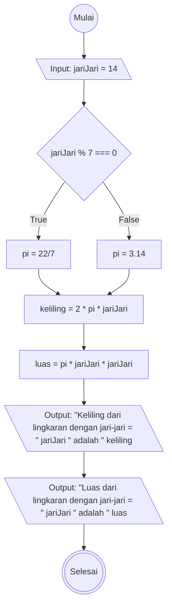

# Algorithma Javascript1

## Task 1

```mermaid
flowchart TD

start@{"shape": circle, "label": "Mulai"}
jarijari@{"shape": lean-l, "label":"Input: jariJari = 14"}
isjariJariMultipleSeven@{"shape": diamond, "label": "jariJari % 7 === 0"}
pi227@{"shape": rectangle, "label": pi = 22/7}
circumference@{"shape": rectangle, "label": keliling = 2 * pi * jariJari}
pi314@{"shape": rectangle, "label": pi = 3.14}
circumference@{"shape": rectangle, "label": keliling = 2 * pi * jariJari}
area@{"shape": rectangle, "label": luas = pi * jariJari * jariJari}
circumferenceOutput@{"shape": lean-l, "label": "Output: #quot;Keliling dari lingkaran dengan jari-jari = #quot; jariJari #quot; adalah #quot; keliling"}
areaOutput@{"shape": lean-l, "label": "Output: #quot;Luas dari lingkaran dengan jari-jari = #quot; jariJari #quot; adalah #quot; luas"}
stop@{"shape": dbl-circ, "label": "Selesai"}

start-->jarijari-->isjariJariMultipleSeven--True-->pi227-->circumference-->area-->circumferenceOutput-->areaOutput-->stop

isjariJariMultipleSeven--False-->pi314-->circumference
```