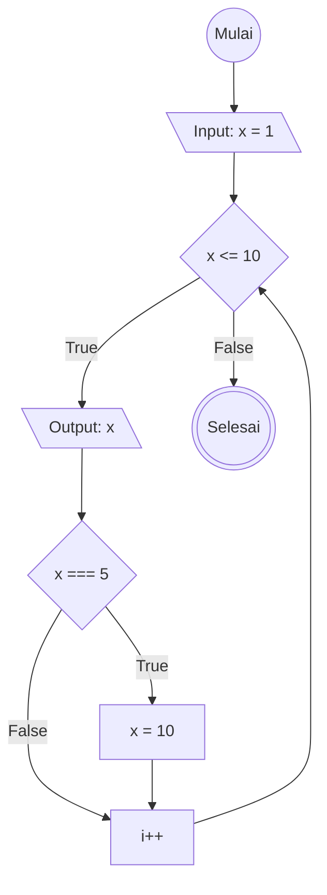

# Flowchart Loop
## Flowchart For Loop

```mermaid
flowchart TD

start@{"shape": circle, "label": "Mulai"}
init@{"shape": lean-l, "label": "Input: x = 1"}
isxLtTen@{"shape": diamond, "label": "x <= 10"}
isxLtTenTrue@{"shape": lean-l, "label": "Output: x"}
isxEqFive@{"shape": diamond, "label": "x === 5"}
isxEqFiveTrue@{"shape": rectangle, "label": "x = 10"}
ipp@{"shape": rectangle, "label": "i++"}
stop@{"shape": dbl-circ, "label": "Selesai"}

start-->init-->isxLtTen--True-->isxLtTenTrue-->isxEqFive--False-->ipp-->isxLtTen
isxEqFive--True-->isxEqFiveTrue-->ipp
isxLtTen--False-->stop
```