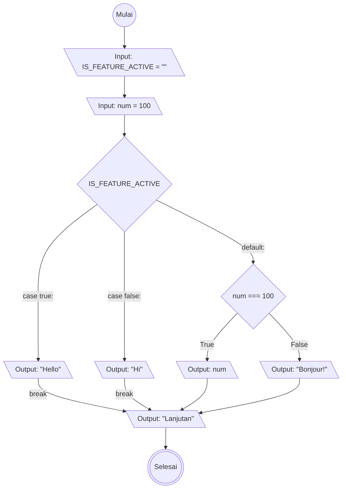

# Flowchart Switch

```mermaid
flowchart TD

start@{"shape": circle, "label": "Mulai"}
inputIsFeatureActive@{"shape": lean-l, "label": "Input: IS_FEATURE_ACTIVE = #quot;#quot;"}
inputNum@{"shape": lean-l, "label": "Input: num = 100"}
isFeatureActive@{"shape": diamond, "label": "IS_FEATURE_ACTIVE"}
isFeatureActiveCaseTrue@{"shape": lean-l, "label": "Output: #quot;Hello#quot;"}
isFeatureActiveCaseFalse@{"shape": lean-l, "label": "Output: #quot;Hi#quot;"}
isFeatureActiveDefault@{"shape": diamond, "label": "num === 100"}
isNumTrue@{"shape": lean-l, "label": "Output: num"}
isNumFalse@{"shape": lean-l, "label": "Output: #quot;Bonjour!#quot;"}
lastOutput@{"shape": lean-l, "label": "Output: #quot;Lanjutan#quot;"}
stop@{"shape": dbl-circ, "label": "Selesai"}

start-->inputIsFeatureActive-->inputNum-->isFeatureActive

isFeatureActive--case true:-->isFeatureActiveCaseTrue--break-->lastOutput
isFeatureActive--case false:-->isFeatureActiveCaseFalse--break-->lastOutput
isFeatureActive--default:-->isFeatureActiveDefault
isFeatureActiveDefault--True-->isNumTrue-->lastOutput
isFeatureActiveDefault--False-->isNumFalse-->lastOutput-->stop


```