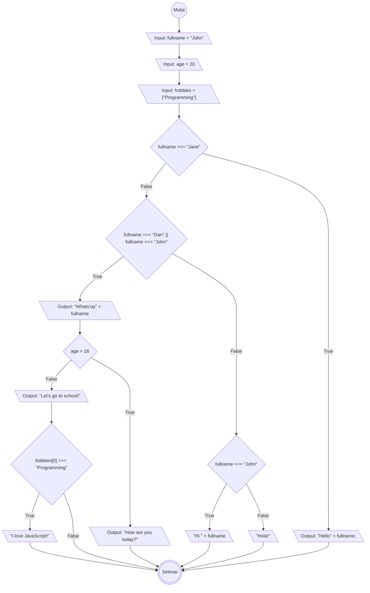

```mermaid
flowchart TD

start@{"shape": circle, "label": "Mulai"}
inputFullname@{"shape": lean-l, "label": "Input: fullname = #quot;John#quot;"}
inputAge@{"shape": lean-l, "label": "Input: age = 20"}
inputHobbies@{"shape": lean-l, "label": "Input: hobbies = [#quot;Programming#quot;]"}
isfullnameJane@{"shape": diamond, "label": fullname === #quot;Jane#quot;}
isfullnameJaneTrue@{"shape": lean-l, "label": "Output: #quot;Hello#quot; + fullname;"}
isfullnameJaneFalse@{"shape": diamond, "label": fullname === #quot;Dan#quot; || fullname === #quot;John#quot;}
isfullnameDanOrJohnTrue@{"shape": lean-l, "label": "Output: #quot;Whats'up#quot; + fullname"}
isfullnameJaneFalseIsFullnameJohn@{"shape": diamond, "label": fullname === #quot;John#quot;}
isfullnameJaneFalseIsFullnameJohnTrue@{"shape": lean-l, "label": "#quot;Hi #quot; + fullname"}
isfullnameJaneFalseIsFullnameJohnFalse@{"shape": lean-l, "label": "#quot;Hola!#quot;"}
isAge@{"shape": diamond, "label": age > 18}
isAgeTrue@{"shape": lean-l, "label": "Output: #quot;How are you today?#quot;"}
isAgeFalse@{"shape": lean-l, "label": "Output: #quot;Let's go to school!#quot;"}
isAgeFalseHobbiesProgramming@{"shape": diamond, "label": "hobbies[0] === #quot;Programming#quot;"}
isAgeFalseHobbiesProgrammingTrue@{"shape": lean-l, "label": "#quot;I love JavaScript!#quot;"}


stop@{"shape": dbl-circ, "label": "Selesai"}

start-->inputFullname-->inputAge-->inputHobbies-->isfullnameJane--False-->isfullnameJaneFalse--True-->isfullnameDanOrJohnTrue-->isAge--False-->isAgeFalse-->isAgeFalseHobbiesProgramming--True-->isAgeFalseHobbiesProgrammingTrue-->stop

isfullnameJane--True-->isfullnameJaneTrue-->stop
isfullnameJaneFalse--False-->isfullnameJaneFalseIsFullnameJohn--True-->isfullnameJaneFalseIsFullnameJohnTrue-->stop
isAge--True-->isAgeTrue-->stop
isfullnameJaneFalseIsFullnameJohn--False-->isfullnameJaneFalseIsFullnameJohnFalse-->stop
isAgeFalseHobbiesProgramming--False-->stop

```