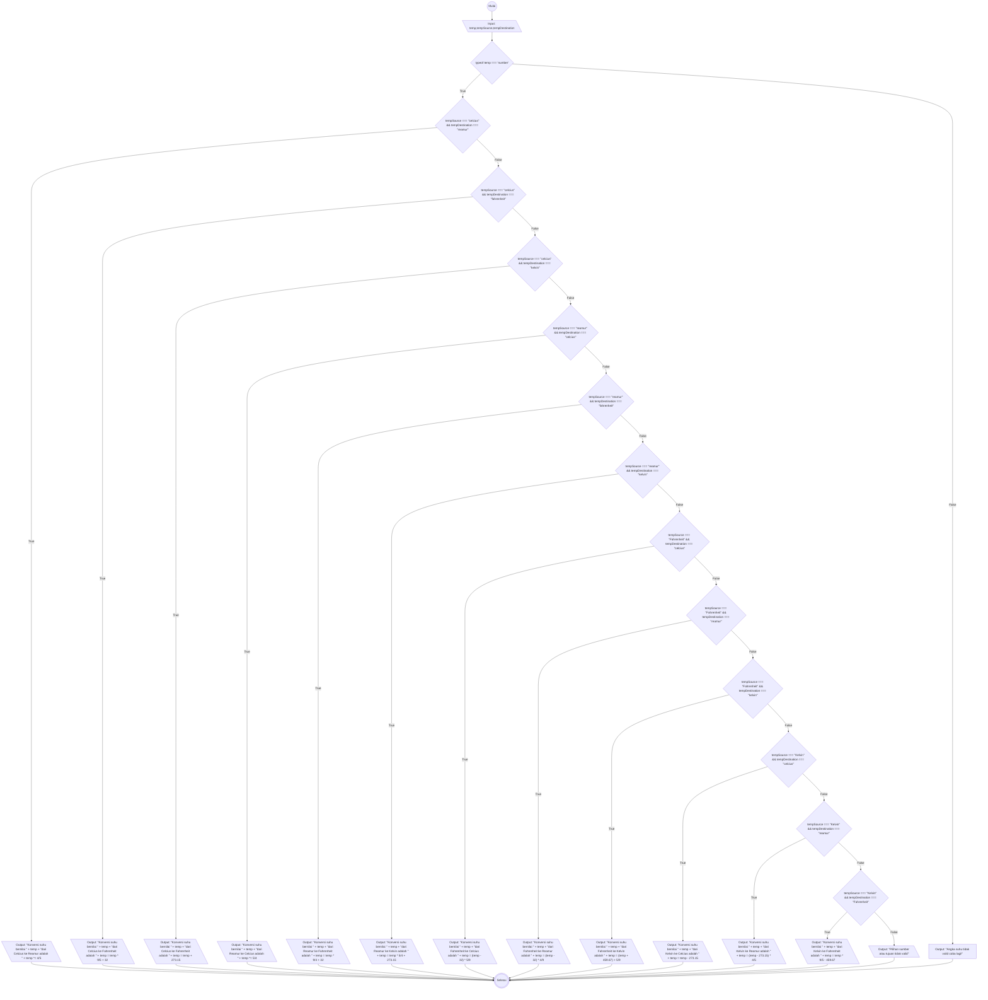

# Flowchart Konversi Suhu 3 Input

```mermaid
flowchart TD

start@{"shape": circle, "label": "Mulai"}
iTemp@{"shape": lean-l, "label": "Input: temp,tempSource,tempDestination"}
stop@{"shape": dbl-circ, "label": "Selesai"}
isNumberTemp@{"shape": diamond, "label": typeof temp === 'number'}
isNumberTempFalse@{"shape": rectangle, "label": "Output: #quot;Angka suhu tidak valid coba lagi!#quot;"}
isCelciusToReamur@{"shape": diamond, "label": "tempSource === #quot;celcius#quot; && tempDestination === #quot;reamur#quot;"}
outputCelciusToReamur@{"shape": rectangle, "label":"Output: #quot;Konversi suhu bernilai #quot; + temp + #quot;dari Celcius ke Reamur adalah #quot; + temp *= 4/5"}

isCelciusToFahrenheit@{"shape": diamond, "label": "tempSource === #quot;celcius#quot; && tempDestination === #quot;fahrenheit#quot;"}
outputCelciusToFahrenheit@{"shape": rectangle, "label":"Output: #quot;Konversi suhu bernilai #quot; + temp + #quot;dari Celcius ke Fahrenheit adalah #quot; + temp = temp * 9/5 + 32"}

isCelciusToKelvin@{"shape": diamond, "label": "tempSource === #quot;celcius#quot; && tempDestination === #quot;kelvin#quot;"}
outputCelciusToKelvin@{"shape": rectangle, "label":"Output: #quot;Konversi suhu bernilai #quot; + temp + #quot;dari Celcius ke Fahrenheit adalah #quot; + temp = temp + 273.15"}

%% from celcius to other

isCelciusToReamur@{"shape": diamond, "label": "tempSource === #quot;celcius#quot; && tempDestination === #quot;reamur#quot;"}
outputCelciusToReamur@{"shape": lean-l, "label":"Output: #quot;Konversi suhu bernilai #quot; + temp + #quot;dari Celcius ke Reamur adalah #quot; + temp *= 4/5"}

isCelciusToFahrenheit@{"shape": diamond, "label": "tempSource === #quot;celcius#quot; && tempDestination === #quot;fahrenheit#quot;"}
outputCelciusToFahrenheit@{"shape": lean-l, "label":"Output: #quot;Konversi suhu bernilai #quot; + temp + #quot;dari Celcius ke Fahrenheit adalah #quot; + temp = temp * 9/5 + 32"}

isCelciusToKelvin@{"shape": diamond, "label": "tempSource === #quot;celcius#quot; && tempDestination === #quot;kelvin#quot;"}
outputCelciusToKelvin@{"shape": lean-l, "label":"Output: #quot;Konversi suhu bernilai #quot; + temp + #quot;dari Celcius ke Fahrenheit adalah #quot; + temp = temp + 273.15"}

%% from Reamur to other

isReamurToCelcius@{"shape": diamond, "label": "tempSource === #quot;reamur#quot; && tempDestination === #quot;celcius#quot;"}
outputReamurToCelcius@{"shape": lean-l, "label":"Output: #quot;Konversi suhu bernilai #quot; + temp + #quot;dari Reamur ke Celcius adalah #quot; + temp *= 5/4"}

isReamurToFahrenheit@{"shape": diamond, "label": "tempSource === #quot;reamur#quot; && tempDestination === #quot;fahrenheit#quot;"}
outputReamurToFahrenheit@{"shape": lean-l, "label":"Output: #quot;Konversi suhu bernilai #quot; + temp + #quot;dari Reamur ke Fahrenheit adalah #quot; + temp = temp * 9/4 + 32"}

isReamurToKelvin@{"shape": diamond, "label": "tempSource === #quot;reamur#quot; && tempDestination === #quot;kelvin#quot;"}
outputReamurToKelvin@{"shape": lean-l, "label":"Output: #quot;Konversi suhu bernilai #quot; + temp + #quot;dari Reamur ke Kelvin adalah #quot; + temp = temp * 5/4 + 273.15"}

%% from Fahrenheit to other

isFahrenheitToCelcius@{"shape": diamond, "label": "tempSource === #quot;Fahrenheit#quot; && tempDestination === #quot;celcius#quot;"}
outputFahrenheitToCelcius@{"shape": lean-l, "label":"Output: #quot;Konversi suhu bernilai #quot; + temp + #quot;dari Fahrenheit ke Celcius adalah #quot; + temp = (temp - 32) * 5/9"}

isFahrenheitToReamur@{"shape": diamond, "label": "tempSource === #quot;Fahrenheit#quot; && tempDestination === #quot;reamur#quot;"}
outputFahrenheitToReamur@{"shape": lean-l, "label":"Output: #quot;Konversi suhu bernilai #quot; + temp + #quot;dari Fahrenheit ke Reamur adalah #quot; + temp = (temp - 32) * 4/9"}

isFahrenheitToKelvin@{"shape": diamond, "label": "tempSource === #quot;Fahrenheit#quot; && tempDestination === #quot;kelvin#quot;"}
outputFahrenheitToKelvin@{"shape": lean-l, "label":"Output: #quot;Konversi suhu bernilai #quot; + temp + #quot;dari Fahrenheit ke Kelvin adalah #quot; + temp = (temp + 459.67) + 5/9"}

%% from Kelvin to other

isKelvinToCelcius@{"shape": diamond, "label": "tempSource === #quot;Kelvin#quot; && tempDestination === #quot;celcius#quot;"}
outputKelvinToCelcius@{"shape": lean-l, "label":"Output: #quot;Konversi suhu bernilai #quot; + temp + #quot;dari Kelvin ke Celcius adalah #quot; + temp = temp - 273.15"}

isKelvinToReamur@{"shape": diamond, "label": "tempSource === #quot;Kelvin#quot; && tempDestination === #quot;reamur#quot;"}
outputKelvinToReamur@{"shape": lean-l, "label":"Output: #quot;Konversi suhu bernilai #quot; + temp + #quot;dari Kelvin ke Reamur adalah #quot; + temp = (temp - 273.15) * 4/5"}

isKelvinToFahrenheit@{"shape": diamond, "label": "tempSource === #quot;Kelvin#quot; && tempDestination === #quot;Fahrenheit#quot;"}
outputKelvinToFahrenheit@{"shape": lean-l, "label":"Output: #quot;Konversi suhu bernilai #quot; + temp + #quot;dari Kelvin ke Fahrenheit adalah #quot; + temp = temp * 9/5 - 459.67"}


%% NaO Not an Option 
outputOtherToOther@{"shape": lean-l, "label": "Output: #quot;Pilihan sumber atau tujuan tidak valid#quot;"}


%% ===================================================
start-->iTemp-->isNumberTemp--True-->isCelciusToReamur

%% Celcius
%% Celcius to Reamur
isCelciusToReamur--True-->outputCelciusToReamur-->stop

%% Celcius to Fahrenheit
isCelciusToReamur--False-->isCelciusToFahrenheit--True-->outputCelciusToFahrenheit-->stop

%% Celcius to Kelvin
isCelciusToFahrenheit--False-->isCelciusToKelvin--True-->outputCelciusToKelvin-->stop

%% To Reamur Section 
isCelciusToKelvin--False-->isReamurToCelcius

%% Reamur

%% Reamur to Celcius
isReamurToCelcius--True-->outputReamurToCelcius-->stop
isReamurToCelcius--False-->isReamurToFahrenheit

%% Reamur to Fahrenheit
isReamurToFahrenheit--True-->outputReamurToFahrenheit-->stop
isReamurToFahrenheit--False-->isReamurToKelvin

%% Reamur to Kelvin
isReamurToKelvin--True-->outputReamurToKelvin-->stop

%% To Fahrenheit Section 
isReamurToKelvin--False-->isFahrenheitToCelcius

%% Fahrenheit

%% Fahrenheit to Celcius
isFahrenheitToCelcius--True-->outputFahrenheitToCelcius-->stop
isFahrenheitToCelcius--False-->isFahrenheitToReamur

%% Fahrenheit to Reamur
isFahrenheitToReamur--True-->outputFahrenheitToReamur-->stop
isFahrenheitToReamur--False-->isFahrenheitToKelvin

%% Fahrenheit to Kelvin
isFahrenheitToKelvin--True-->outputFahrenheitToKelvin-->stop

%% To Kelvin Section 
isFahrenheitToKelvin--False-->isKelvinToCelcius

%% Kelvin

%% Kelvin to Celcius
isKelvinToCelcius--True-->outputKelvinToCelcius-->stop
isKelvinToCelcius--False-->isKelvinToReamur

%% Kelvin to Reamur
isKelvinToReamur--True-->outputKelvinToReamur-->stop
isKelvinToReamur--False-->isKelvinToFahrenheit

%% Kelvin to Fahrenheit
isKelvinToFahrenheit--True-->outputKelvinToFahrenheit-->stop

%% Not an Option nice try
isKelvinToFahrenheit--False-->outputOtherToOther-->stop

isNumberTemp--False-->isNumberTempFalse-->stop
```